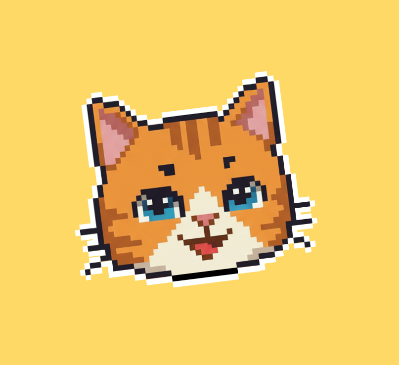

<div align="center">



# Calopal

**A nutrition tracker with a virtual pet that cares whether you hit your goals.**

Log your meals, set macro goals, and keep your pixel-art cat happy. When you meet your goals, your cat gets happier and you unlock decorations for its room. When you skip days, it notices.


<br />


<sub>The cat's five moods, driven by how consistently you meet your goals.</sub>

</div>

---

## Contents

- [Overview](#overview)
  - [My Role](#my-role)
- [Features](#features)
- [Product Management](#product-management)
  - [Problem & Vision](#problem--vision)
  - [Target Users](#target-users)
  - [User Stories & Acceptance Criteria](#user-stories--acceptance-criteria)
  - [Process: Scrum Over Four Sprints](#process-scrum-over-four-sprints)
  - [Sprint Outcomes](#sprint-outcomes)
  - [Retrospective Takeaways](#retrospective-takeaways)
  - [Backlog & Roadmap](#backlog--roadmap)
- [Technical Overview](#technical-overview)
- [Getting Started](#getting-started)
- [Known Issues](#known-issues)
- [Team](#team)

---

## Overview

Calopal is a cross-platform mobile app built with **React Native + Expo** for a university software engineering course (Fall 2025). A team of five built it over four two-week Scrum sprints.

Most calorie trackers rely on willpower and charts. Calopal adds **emotional accountability**: a pet whose mood depends on whether you keep up your habits. The app is fully offline. All data lives on-device in SQLite, and the USDA FoodData Central API is used only for food search.

### My Role

I was the technical lead on a five-person team. My work included:

- **Architecture.** I designed the app's overall structure: the separation of screens, data hooks and database, the navigation flow, and the startup sequence that runs migrations and routes users to onboarding.
- **Backend & data layer.** I built the full SQLite + Drizzle ORM backend, including the schema, the versioned migrations and the migration gate that runs at startup.
- **Data hooks.** I wrote every data-access hook (`useOnboarding`, `useGoals`, `useMeals`, `useFoods` and `useCosmetics`) and documented them in [`docs/hooks/`](docs/hooks).
- **Screens.** I built the onboarding (intro) screen, the food items screen and the meals screen.
- **Integration.** I connected the other screens to the backend and handled most of the cross-feature debugging.
- **Scrum facilitation.** I ran the team's Scrum process across all four sprints. That included leading stand-ups and sprint planning, keeping the Miro board and burn-up charts up to date, and running the sprint reviews and retrospectives.

## Features

| | Feature | Details |
|---|---|---|
| 🐱 | **Living home screen** | An animated cat wanders its room. Its sprite reflects a hidden *happiness score* across five moods, from angry to very happy. |
| 🎯 | **Macro goals** | Set daily targets for calories, protein, fat and carbs. Each goal can be a **minimum** ("at least") or a **maximum** ("at most"). Goals carry over each day automatically. |
| 📈 | **Weekly report** | A 7-day view with a ✅ for each day you met your goals, plus a color-coded macro breakdown. |
| 🍽️ | **Meal logging** | Build meals from food items with serving sizes. Macros are totaled per food and per meal. |
| 🔎 | **Food search** | Search the **USDA FoodData Central** database. Calories, protein, fat and carbs are parsed out of each result automatically. |
| ✍️ | **Custom foods** | Enter your own items from a nutrition label. Previously eaten foods and meals are saved so you can find them again. |
| 🛋️ | **Unlockable decorations** | Cosmetics (cat bed, food bowl, cat tree, …) unlock every 15 completed goals and can be toggled on in the cat's room. |
| 👋 | **Personalized onboarding** | On first launch, you name yourself and your pet and set your starting goals. |

### How the pet's mood works

```
Happiness score  0–4    5–9    10–14     15–19    20+
Mood             angry  sad    neutral   happy    very happy
```

- New pets start at **12** (neutral).
- Completing **2 / 3 / 4** daily goals adds **+2 / +4 / +5** happiness.
- Each day you don't open the app costs **−2** happiness, so the pet rewards consistency, not just occasional effort.

---

## Product Management

> The full project documentation (release plan, sprint plans and reviews, burn-up charts, Definition of Done, style guide and test plan) is indexed in the [**project management tracker**](https://docs.google.com/spreadsheets/d/1MJUmmVKrJdNKZ-HmoEoerkga3mLxRGds6eEHWYWUD_o/edit?gid=0#gid=0).

### Problem & Vision

Diet tracking has a well-known retention problem. Logging food is tedious, progress is slow, and nothing pushes back when you stop. Many people abandon calorie apps within a few weeks.

**Our hypothesis:** a pet that reacts to your behavior gives you a reason to come back every day. Duolingo's owl and Tamagotchi-style games show that this kind of attachment works. The release plan set five high-level goals:

1. Track caloric intake throughout a day.
2. Let users set daily goals and see whether they were met.
3. Reward users when goals are met.
4. Let users interact with their pet using those rewards.
5. Make the pet **charming enough to motivate the user** to keep using the app.

### Target Users

| Segment | Who they are | What they need | How Calopal serves them |
|---|---|---|---|
| **Casual health-improvers** *(primary)* | Students and young adults (≈18–30) who want to eat better but have quit tracking apps before | Low-friction logging and a reason to keep going | Quick food search, reusable meals, and a pet that gets sad when they disappear |
| **Macro-focused gym-goers** | People tracking protein, carbs and fat for training | Per-macro targets, including "at least" goals like protein minimums | Min/max goals for all four macros with a weekly hit-rate view |
| **Gamers & cozy-game fans** | Players of pet, collection and "cozy" games | Progression, collectibles and personality | Mood states, unlockable room decorations and pixel-art style |

**Design implications we took from this audience:**
- **Pet first.** The app opens on the cat, not on a spreadsheet of numbers. This was our #1 user story.
- **Positive framing.** Goals are framed as caring for the pet rather than restricting yourself.
- **Low friction.** API search and saved meals mean users rarely type nutrition data by hand.
- **Offline and private.** No account or sign-up, and all data stays on the device.

### User Stories & Acceptance Criteria

The three core stories shipped in the release:

<details open>
<summary><b>1. "As a user, I want to see the pet first when I open the app, because I think that's cute."</b></summary>

- The cat is visible on the home screen.
- The cat is animated.
- The cat reflects the user's goal completion rate through emotional sprites.
</details>

<details>
<summary><b>2. "As a user, I want to manually add a food item and its macronutrients, so I can keep track of it."</b></summary>

- The user can create a meal and add food items to it.
- The user can add a custom food item.
- The user can find and add a food item with a nutrition label (API search).
- The user can see previously eaten meals.
</details>

<details>
<summary><b>3. "As a user, I want to be able to set macronutrient goals."</b></summary>

- On first launch, the user sets initial goals for calories, protein, fat and carbs.
- Goals persist between app sessions.
- Goal progress increases when the user logs a meal.
- Goals can be modified from a pop-up on the Goals screen.
- The user can see how often they achieved their goals over the past week.
</details>

Supporting stories delivered: **data persistence between sessions**, **personalized onboarding**, **pet reacts to user behavior** and **rewards for meeting goals** (cosmetics).

### Process: Scrum Over Four Sprints

| Practice | How we ran it |
|---|---|
| **Cadence** | 4 × two-week sprints (Oct 14 – Dec 2, 2025), each with a sprint plan and a sprint review/retrospective |
| **Stand-ups** | 3× weekly scrums, time-boxed to the three core questions |
| **Backlog & board** | User stories broken into hour-estimated tasks on a Miro scrum board, with color-coded ownership |
| **Estimation** | Story points per user story, ideal hours per task |
| **Tracking** | Per-sprint and combined **burn-up charts** |
| **Quality gates** | A written **Definition of Done** covering engineering ("did we build it right?") and UX ("did we build the right thing?"), plus an app-wide **style guide** and a **test plan** |
| **Collaboration** | A "files-in-use" channel to check out files before editing, which kept merge conflicts rare with five developers in one codebase |
| **Roles** | Dedicated Product Owner and developers |

### Sprint Outcomes

| Sprint | Dates | Goal / focus | Outcome |
|---|---|---|---|
| **1** | Oct 14 – 21 | App shell, navigation, food input, persistence | ✅ Manual food input and SQLite persistence done. Pet screen rolled over: the first week went to team formation and learning React Native. |
| **2** | Oct 21 – Nov 4 | Macro goals, USDA food search, food history | 🟡 Goals and API search mostly complete. The hardest work (wiring UI to the DB) slipped. |
| **3** | Nov 4 – 18 | *"A pet that is interactable and reacts to the user's inputs and goal completion"* | 🟡 Rewards system mostly complete. Velocity dropped because of underestimated tasks, vague stories and outside coursework. Multi-species pets were **descoped**. |
| **4** | Nov 18 – Dec 2 | Pet reactions, onboarding, rewards | ✅ Pet mood reactions and personalized onboarding done. Rewards mostly complete. The highest work volume of any sprint. |

**Scope decisions.** Choosing a pet species, petting interactions, an in-app currency shop and a goal-history screen were all planned at various points. As the deadline got closer, the Product Owner moved them to the backlog so the team could ship a polished core loop of **log food → hit goals → happy pet**.

### Retrospective Takeaways

What the team learned across four sprint reviews:

- **Write smaller, specific tasks.** Vague tasks caused the most rollover. By Sprint 4 the rule was: if a task is partly done, close it and create a new task for the remainder.
- **Define "done" up front.** Adding a formal Definition of Done mid-project made progress measurable and made reviews faster.
- **Share the design before splitting the work.** Unshared design plans created hidden dependencies between tasks.
- **Keep scrums short.** Early meetings ran long on big-picture discussion. Time-boxing them freed up time for the sprint's actual work.
- **Co-locate for integration.** In-person group coding sessions in Sprint 4 sped up bug fixing and integration noticeably.
- **Keep the file check-out channel.** It was cited in every retrospective as the reason merge conflicts stayed rare.

### Backlog & Roadmap

- [ ] **More pets:** dog, monkey and banana slug (concept art is in `assets/images/`)
- [ ] **In-app currency** earned from goals and spent on room decorations
- [ ] **Petting interaction:** touch reactions and animation
- [ ] **Goal history** screen for setting better future goals
- [ ] **Unique pet personalities**
- [ ] **Shelter adoption:** start by adopting a randomly generated pet
- [ ] **Hardcore mode:** neglect your pet and you lose it
- [ ] **Step tracking** to "walk" your pet
- [ ] **Social visits:** your pet visits nearby users' rooms
- [ ] Push-notification reminders, smoother animations

---

## Technical Overview

### Stack

| Layer | Technology |
|---|---|
| Framework | React Native 0.81, Expo SDK 54 (New Architecture), Expo Router |
| Language | TypeScript |
| Navigation | React Navigation (bottom tabs + native stack) |
| UI | React Native Paper, custom pixel font, Reanimated |
| Data | SQLite (`expo-sqlite`) with **Drizzle ORM** and versioned migrations |
| External API | [USDA FoodData Central](https://fdc.nal.usda.gov/api-guide) |
| Build | EAS Build (development / preview / production profiles) |

### Architecture

```
┌────────────────────────── Screens (app/src/screens) ──────────────────────────┐
│  Onboarding · Home · Goals · Meals · Add Meal · Food Search · Decorations     │
└───────────────────────────────────┬───────────────────────────────────────────┘
                                    │  call
┌───────────────────────────── Hooks (app/src/hooks) ───────────────────────────┐
│  useOnboarding · useGoals · useMeals · useFoods · useCosmetics                │
│  Encapsulate all DB access so screens never write SQL.                        │
└───────────────────────────────────┬───────────────────────────────────────────┘
                                    │  Drizzle ORM
┌─────────────────────────── SQLite (on-device) ────────────────────────────────┐
│  user_details · goals · meals · meal_components · foods · cosmetics           │
└───────────────────────────────────────────────────────────────────────────────┘
```

Migrations in [`drizzle/`](drizzle) run automatically at startup. A `DatabaseGate` component keeps the app from rendering until the schema is up to date. Developer guides for the data hooks are in [`docs/hooks/`](docs/hooks).

### Project structure

```
Calopal/
├── app/
│   ├── _layout.tsx          # Root: fonts, splash, SQLite provider, migration gate
│   ├── index.tsx            # Navigation, onboarding routing, daily goal rollover
│   └── src/
│       ├── components/      # Animated cat
│       ├── context/         # Global state (active meal / food)
│       ├── db/              # Drizzle schema + migration hook
│       ├── hooks/           # Data-access hooks (goals, meals, foods, cosmetics, user)
│       ├── screens/         # App screens
│       └── style/           # Shared styles
├── assets/                  # Pixel art, cosmetics, font
├── docs/hooks/              # Hook developer documentation
└── drizzle/                 # SQL migrations + snapshots
```

---

## Getting Started

### Prerequisites

- Node.js 18+ and npm
- An Android emulator (Android Studio, API 35) or iOS Simulator (Xcode), or a physical device
- *Optional:* a free [USDA FoodData Central API key](https://fdc.nal.usda.gov/api-key-signup)

> Calopal uses `expo-dev-client`, so it runs as a **development build** rather than in Expo Go.

### Install & run

```bash
git clone https://github.com/quinnFelton/Calopal.git
cd Calopal
npm install
cp .env.example .env   # optional: add your USDA API key
npm run android        # or: npm run ios
```

Once a development build is installed on your device or emulator, `npm start` launches the dev server with hot reload.

### Scripts

| Command | Description |
|---|---|
| `npm start` | Start the Expo dev server |
| `npm run android` / `npm run ios` | Build and run a native development build |
| `npm run lint` | Run ESLint |
| `eas build --platform android` | Build an installable APK/AAB with EAS |

---

## Known Issues

Calopal 1.0 was released as a course deliverable. Issues documented at release include:

- Cosmetics don't always appear on the home screen after being selected.
- The weekly report sometimes needs a goal edit before it shows updated values.
- Some text buttons only respond to taps on the label, not the whole button.
- The cat occasionally walks slightly below the tab bar, and it doesn't switch to a walking sprite while moving.
- The USDA API rate limit is shared per key, so heavy use by one client can block search for everyone. A production version would proxy requests through a backend.

---

## Team

Built by a five-person team for a university software engineering course, Fall 2025.

| Name | Role |
|---|---|
| Vinh An Nguyen | Product Owner, Developer |
| Andrew Bell | Developer |
| Corbin Naderzad | Developer |
| Christopher Gonzalez-Ordonez | Developer |
| **Quinn Felton** | **Lead Developer:** architecture, backend, data hooks, integration |

<sub>Calopal © 2025 the Calopal team. All rights reserved.</sub>
